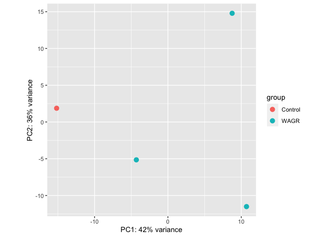
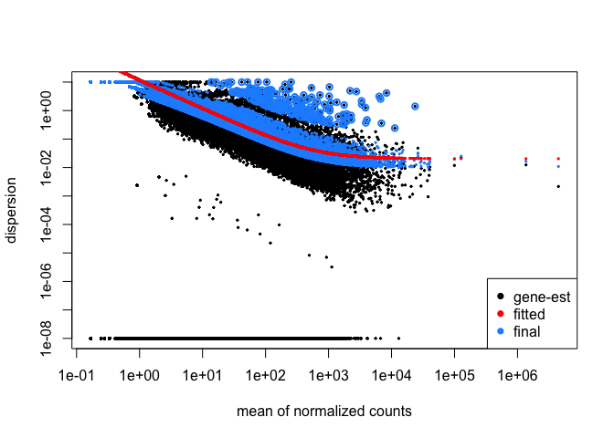
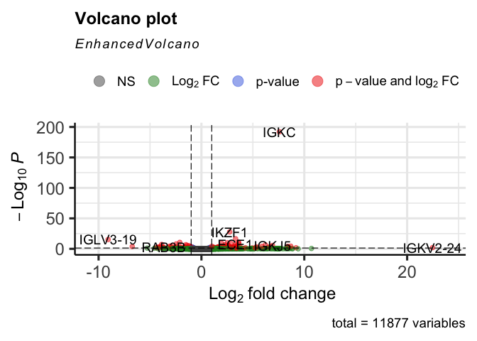
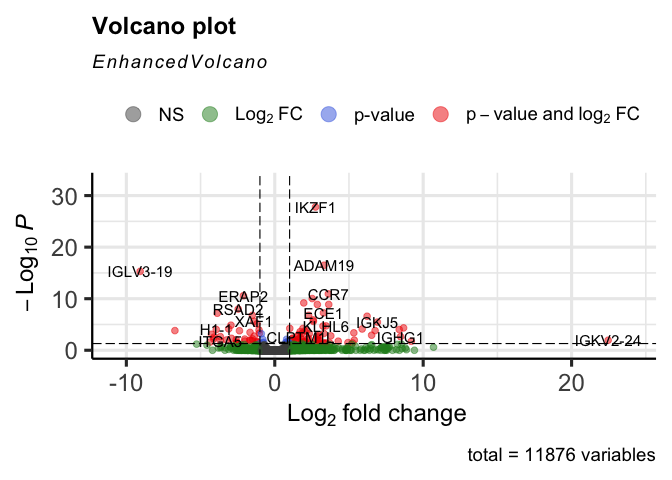
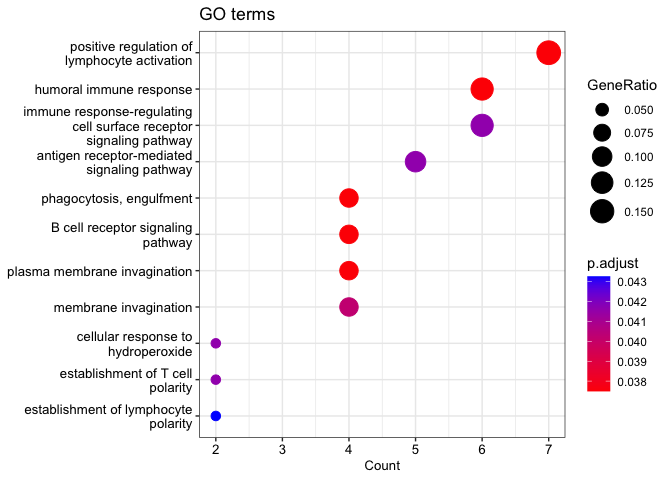
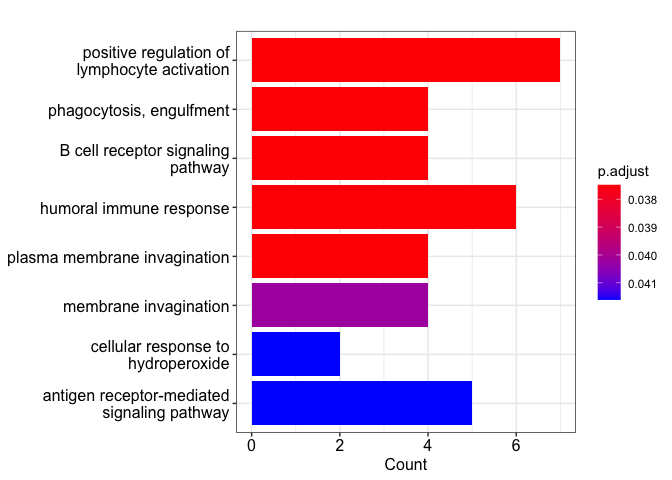
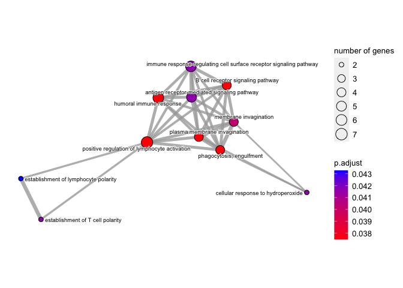

Bulk RNA analysis pipeline
================

## Introduction

This is a demonstration of a simple RNA-seq analysis pipeline.

The raw data is retrieved from GEO of NCBI. The accession number is
*GSE119360*.

In brief, SRA data was retrieved using `prefetch`.

SRA data is transformed into FASTQ files using `fastq-dump`.

`fastqc` and `multiqc` are used for quality control.

Since the samples are sequenced using *Illumina Genome analyszer II*,
short (50bp) pair-end RNA sequences are generated. Judging by the QC
reports, no trimming is done.

These sequences are then mapped to *GRCh38.p10_v26* using `STAR`, by
first building an index with the desired reference and then mapping to
such index.

Mapped fragments are counted using `featureCounts` from `subread`
toolkit. Counts are stored in *counts_extracted.out*.

The results are then imported to `R` and analyzed using `DESeq2`.

The code of the first portion of data processing is shown below.

``` bash
cat RNA-seq_preproc.sh
```

    ## #!bin/bash
    ## 
    ## conda activate rna-seq
    ## 
    ## ##get data from SRA
    ## 
    ## echo "Starting prefetch"
    ## seq -f %1.0f 3371765  3371768 | while read x; do echo GSM${x} ;done |  parallel -j0 --bar 'prefetch  {.}'
    ## echo "DONE prefetch"
    ## 
    ## mkdir -p raw_data
    ## echo "fastq-dump for paired-reads"
    ## find . | grep [0-9].sra | while read x; do a=$(basename $x); sub=${a%%.*} ; echo fastq-dump  --defline-qual "+" -v --split-files  -O raw_data/ --gzip ${sub}  ;done
    ## echo "DONE fastq-dump"
    ## 
    ## 
    ## mkdir -p QC
    ## echo "fastqc and multiqc"
    ## ls *fastq.gz | while read x; do fastqc -t 6 -o QC/ ${x} ;done
    ## cd QC
    ## multiqc .
    ## cd ..
    ## echo "DONE QC"
    ## 
    ## echo "building STAR index"
    ## STAR --runThreadN 48 --runMode genomeGenerate --genomeDir GRCh38.primary_assembly.index --genomeFastaFiles GRCh38.primary_assembly.genome.fa --sjdbGTFfile gencode.v26.primary_assembly.annotation.gtf --sjdbOverhang 99
    ## echo "Done building STAR index"
    ## 
    ## mkdir -p results
    ## echo "STAR mapping"
    ## cd .. raw_data/
    ## ls *fastq.gz | while read x; do gunzip ${x} & done
    ## cd ..
    ## ## setting higher limit of parallel processes
    ## ulimit -n 10000
    ## find . | grep 1.fastq$ | while read x; do a=$(basename ${x}) ; sub=${a%%_*} ; STAR --genomeDir GRCh38.primary_assembly.index/ --runThreadN 48 --readFilesIn raw_data/${sub}_1.fastq raw_data/${sub}_2.fastq --outSAMtype BAM SortedByCoordinate --outSAMunmapped Within --outSAMattributes Standard --outFileNamePrefix ${sub} ;done
    ## ulimit -n 1024
    ## echo "Done STAR mapping"
    ## 
    ## echo "featureCounts"
    ## cd results/
    ## featureCounts    -p --countReadPairs \
    ##          -a ../gencode.v26.primary_assembly.annotation.gtf \
    ##          -T 48 \
    ##      -t exon \
    ##      -g gene_id \
    ##      -o counts.out  \
    ##      *bam
    ## 
    ## cat counts.out | cut -f 1,7- > counts_extracted.out
    ## echo "Done featureCounts"
    ## 
    ## cd ..

The second portion of data analysis starts with importing data from
*featureCounts*, as shown below.

Please refer to the [GEO
website](https://www.ncbi.nlm.nih.gov/geo/query/acc.cgi?acc=GSE119360)
for more sample preparation details.

## Libraries

``` r
library(tidyverse)
library(EnhancedVolcano)
library(clusterProfiler)
library(enrichplot)
library(DOSE)
library(ggnewscale)
library(pathview)
library(GEOquery)
library(ggplot2)
library(tximport)
library(DESeq2)
library(org.Hs.eg.db)
library(ComplexHeatmap)
library(RColorBrewer)
library(circlize)
library(dplyr)
```

## Getting metadata

``` r
gse <- getGEO(GEO = "GSE119360", GSEMatrix = T)
```

    ## Found 1 file(s)

    ## GSE119360_series_matrix.txt.gz

``` r
meta <- pData(phenoData(gse[[1]]))
```

Subsetting metadata

``` r
meta.subset = meta %>% 
  mutate(group = gsub("\\d_", "", title)) %>% 
  dplyr::select(group)

meta.subset$group = as.factor(meta.subset$group)
levels(meta.subset$group)
```

    ## [1] "Control" "WAGR"

``` r
meta.subset
```

    ##              group
    ## GSM3371765 Control
    ## GSM3371766    WAGR
    ## GSM3371767    WAGR
    ## GSM3371768    WAGR

## Importing data from *featureCounts*

``` r
count.data = read.table("counts_extracted.out",header = T,sep = "\t", row.names = 1)
names = paste0("SRR",seq(7777133,7777136))
colnames(count.data) = names
rownames(meta.subset) = names
head(count.data)
```

    ##                   SRR7777133 SRR7777134 SRR7777135 SRR7777136
    ## ENSG00000223972.5          0          0          0          0
    ## ENSG00000227232.5          4          4          1          1
    ## ENSG00000278267.1          0          0          2          1
    ## ENSG00000243485.5          0          0          0          0
    ## ENSG00000284332.1          0          0          0          0
    ## ENSG00000237613.2          0          0          0          0

## DESeq

``` r
dds = DESeqDataSetFromMatrix(countData = count.data, colData = meta.subset, design = ~group)
dds = DESeq(dds)
```

    ## estimating size factors

    ## estimating dispersions

    ## gene-wise dispersion estimates

    ## mean-dispersion relationship

    ## final dispersion estimates

    ## fitting model and testing

PCA plot to show that there is separation between two groups of sample.
As shown, PC1 accounts for 42% of the difference between the two groups.

``` r
vst=varianceStabilizingTransformation(dds, blind = F)
plotPCA(vst, intgroup = "group")
```

<!-- -->

Dispersion plot for QC. The red fitted line is decreasing as counts
increases. This is what we want to see.

``` r
plotDispEsts(dds)
```

<!-- -->

Extracting results and filtering out insignificant p-values.

Visualize results using volcano plot.

``` r
res = results(dds, contrast = c("group", "WAGR", "Control"))
res = na.omit(res)

ensembl_id = rownames(res)
ensembl_id = gsub("\\.\\d{1,}","", ensembl_id)
res$symbol = mapIds(org.Hs.eg.db, 
       keys = ensembl_id, 
       keytype = "ENSEMBL", 
       column =  "SYMBOL")
res.df = as.data.frame(res)
res.df = na.omit(res.df)
EnhancedVolcano(res.df, 
                x= "log2FoldChange", 
                y = "padj", 
                lab = res.df$symbol,
                pCutoff = 0.05)
```

<!-- -->

The IGKC gene is an outlier, removing outlier for better visualization.

``` r
res.df = res.df %>% 
  arrange(padj) %>% 
  filter(symbol != "IGKC")

EnhancedVolcano(res.df, 
                x= "log2FoldChange", 
                y = "padj", 
                lab = res.df$symbol,
                labSize = 4,
                pCutoff = 0.05)
```

<!-- -->

The summary table shows us how many genes are up or down regulated.

``` r
sigs = res[res$padj < 0.05,] ## only keeping padj < 0.05

## adding symbols per ensembl gene id
ensembl_id = rownames(sigs)
ensembl_id = gsub("\\.\\d{1,}","", ensembl_id)
sigs$symbol = mapIds(org.Hs.eg.db, 
       keys = ensembl_id, 
       keytype = "ENSEMBL", 
       column =  "SYMBOL")
```

    ## 'select()' returned 1:1 mapping between keys and columns

``` r
sigs = na.omit(sigs)
summary(sigs)
```

    ## 
    ## out of 115 with nonzero total read count
    ## adjusted p-value < 0.1
    ## LFC > 0 (up)       : 73, 63%
    ## LFC < 0 (down)     : 42, 37%
    ## outliers [1]       : 0, 0%
    ## low counts [2]     : 0, 0%
    ## (mean count < 21)
    ## [1] see 'cooksCutoff' argument of ?results
    ## [2] see 'independentFiltering' argument of ?results

``` r
df.hm = sigs[(sigs$baseMean > 50) & (abs(sigs$log2FoldChange) > 2),] ## Further filtering noise out
df.hm = df.hm[order(df.hm$log2FoldChange, decreasing = T),]
df.hm = as.data.frame(df.hm)
head(df.hm)
```

    ##                      baseMean log2FoldChange     lfcSE      stat        pvalue
    ## ENSG00000241294.1   254.64444      22.464333 5.6491654  3.976576  6.991479e-05
    ## ENSG00000211595.2    89.91385       9.198290 2.3937204  3.842675  1.217006e-04
    ## ENSG00000211653.2   342.75285       8.679738 1.6233351  5.346855  8.949545e-08
    ## ENSG00000211896.7  3866.21186       8.477069 1.9137235  4.429621  9.439888e-06
    ## ENSG00000211893.3   278.67758       8.385999 1.6187003  5.180699  2.210556e-07
    ## ENSG00000211592.8 22883.30711       7.581774 0.2532418 29.938874 6.141852e-197
    ##                            padj   symbol
    ## ENSG00000241294.1  1.134832e-02 IGKV2-24
    ## ENSG00000211595.2  1.814612e-02    IGKJ3
    ## ENSG00000211653.2  4.590401e-05 IGLV1-40
    ## ENSG00000211896.7  2.241624e-03    IGHG1
    ## ENSG00000211893.3  9.433031e-05    IGHG2
    ## ENSG00000211592.8 7.875696e-193     IGKC

## Calculating z-score table for heatmap

``` r
rlog_out = rlog(dds, blind=F) ## transform count into log2 scale
mat = assay(rlog_out)[rownames(df.hm),] ## subsetting those which pass the filter from above
base_mean = rowMeans(mat) 
mat.scaled = t(apply(mat, 1, scale)) ## z-score
colnames(mat.scaled) = colnames(mat)
head(mat.scaled)
```

    ##                   SRR7777133  SRR7777134 SRR7777135 SRR7777136
    ## ENSG00000241294.1 -0.5159537 -0.48508582 -0.4988409  1.4998804
    ## ENSG00000211595.2 -0.9316042  0.28343629 -0.6355297  1.2836976
    ## ENSG00000211653.2 -1.3188894  0.96614834  0.5402901 -0.1875490
    ## ENSG00000211896.7 -1.2822432  0.31210190  1.1127082 -0.1425668
    ## ENSG00000211893.3 -1.3271053  0.04800409  0.1821464  1.0969548
    ## ENSG00000211592.8 -1.4984803  0.50212814  0.5532454  0.4431068

``` r
##keeping only a certain number of most significant rows
keep = 25
rows_keep = c(seq(1,keep), seq((nrow(mat.scaled)-keep), nrow(mat.scaled)))
rows_keep
```

    ##  [1]  1  2  3  4  5  6  7  8  9 10 11 12 13 14 15 16 17 18 19 20 21 22 23 24 25
    ## [26] 44 45 46 47 48 49 50 51 52 53 54 55 56 57 58 59 60 61 62 63 64 65 66 67 68
    ## [51] 69

``` r
h= Heatmap(mat.scaled[rows_keep,], 
              cluster_rows = T, 
             cluster_columns = T,
             column_labels = colnames(mat.scaled),
             row_labels = df.hm[rows_keep,]$symbol,
             row_names_gp = gpar(fontsize = 8),
             name = "Z-score",
             height = unit(12,"cm"),
             width = unit(5, "cm")) 

png("heatmap.png", res = 200, width = 800, height = 1500)
print(h)
dev.off()
```

    ## quartz_off_screen 
    ##                 2

{width = 50%, height = 50%}

As shown in the heatmap, the differential gene expression is easily seen
between the two groups. SRR7777133 is the Control, while the rest of the
samples are WAGR mutants.

## Functional analysis

To understand what the possible functions of these genes are, we can
look at gene ontology.

``` r
## getting Ensembl IDs
GO_ensembl_id = rownames(df.hm[rows_keep,])
GO_ensembl_id = gsub("\\.\\d{1,}", "", GO_ensembl_id)

ego = enrichGO(gene = GO_ensembl_id, 
         OrgDb = "org.Hs.eg.db",
         keyType = "ENSEMBL", 
         ont = "BP",
         readable = T)

dotplot(ego, 
        showCategory = 20, 
        x = "count",
        font.size = 10,
        title = "GO terms")
```

<!-- -->

``` r
barplot(ego)
```

<!-- -->

``` r
## Add similarity matrix to the termsim slot of enrichment result
ego <- enrichplot::pairwise_termsim(ego)

emapplot(ego, showCategory = 20, 
         cex_label_category = 0.5,
         cex_category = 0.8)
```

<!-- -->

System info for replicability.

``` r
sessionInfo()
```

    ## R version 4.2.1 (2022-06-23)
    ## Platform: x86_64-apple-darwin17.0 (64-bit)
    ## Running under: macOS Catalina 10.15.7
    ## 
    ## Matrix products: default
    ## BLAS:   /Library/Frameworks/R.framework/Versions/4.2/Resources/lib/libRblas.0.dylib
    ## LAPACK: /Library/Frameworks/R.framework/Versions/4.2/Resources/lib/libRlapack.dylib
    ## 
    ## locale:
    ## [1] en_US.UTF-8/en_US.UTF-8/en_US.UTF-8/C/en_US.UTF-8/en_US.UTF-8
    ## 
    ## attached base packages:
    ## [1] grid      stats4    stats     graphics  grDevices utils     datasets 
    ## [8] methods   base     
    ## 
    ## other attached packages:
    ##  [1] circlize_0.4.15             RColorBrewer_1.1-3         
    ##  [3] ComplexHeatmap_2.12.0       org.Hs.eg.db_3.15.0        
    ##  [5] AnnotationDbi_1.58.0        DESeq2_1.36.0              
    ##  [7] SummarizedExperiment_1.26.1 MatrixGenerics_1.8.1       
    ##  [9] matrixStats_0.62.0          GenomicRanges_1.48.0       
    ## [11] GenomeInfoDb_1.32.2         IRanges_2.30.0             
    ## [13] S4Vectors_0.34.0            tximport_1.24.0            
    ## [15] GEOquery_2.64.2             Biobase_2.56.0             
    ## [17] BiocGenerics_0.42.0         pathview_1.36.0            
    ## [19] ggnewscale_0.4.7            DOSE_3.22.0                
    ## [21] enrichplot_1.16.1           clusterProfiler_4.4.4      
    ## [23] EnhancedVolcano_1.14.0      ggrepel_0.9.1              
    ## [25] forcats_0.5.1               stringr_1.4.0              
    ## [27] dplyr_1.0.9                 purrr_0.3.4                
    ## [29] readr_2.1.2                 tidyr_1.2.0                
    ## [31] tibble_3.1.8                ggplot2_3.3.6              
    ## [33] tidyverse_1.3.2            
    ## 
    ## loaded via a namespace (and not attached):
    ##   [1] utf8_1.2.2             R.utils_2.12.0         tidyselect_1.1.2      
    ##   [4] RSQLite_2.2.15         BiocParallel_1.30.3    scatterpie_0.1.7      
    ##   [7] munsell_0.5.0          codetools_0.2-18       withr_2.5.0           
    ##  [10] colorspace_2.0-3       GOSemSim_2.22.0        highr_0.9             
    ##  [13] knitr_1.39             rstudioapi_0.13        labeling_0.4.2        
    ##  [16] KEGGgraph_1.56.0       GenomeInfoDbData_1.2.8 polyclip_1.10-0       
    ##  [19] bit64_4.0.5            farver_2.1.1           downloader_0.4        
    ##  [22] vctrs_0.4.1            treeio_1.20.1          generics_0.1.3        
    ##  [25] xfun_0.31              R6_2.5.1               doParallel_1.0.17     
    ##  [28] clue_0.3-61            graphlayouts_0.8.0     locfit_1.5-9.6        
    ##  [31] bitops_1.0-7           cachem_1.0.6           fgsea_1.22.0          
    ##  [34] gridGraphics_0.5-1     DelayedArray_0.22.0    assertthat_0.2.1      
    ##  [37] scales_1.2.0           ggraph_2.0.5           googlesheets4_1.0.0   
    ##  [40] gtable_0.3.0           tidygraph_1.2.1        rlang_1.0.4           
    ##  [43] genefilter_1.78.0      GlobalOptions_0.1.2    splines_4.2.1         
    ##  [46] lazyeval_0.2.2         gargle_1.2.0           broom_1.0.0           
    ##  [49] yaml_2.3.5             reshape2_1.4.4         modelr_0.1.8          
    ##  [52] backports_1.4.1        qvalue_2.28.0          tools_4.2.1           
    ##  [55] ggplotify_0.1.0        ellipsis_0.3.2         Rcpp_1.0.9            
    ##  [58] plyr_1.8.7             zlibbioc_1.42.0        RCurl_1.98-1.7        
    ##  [61] GetoptLong_1.0.5       viridis_0.6.2          haven_2.5.0           
    ##  [64] cluster_2.1.3          fs_1.5.2               magrittr_2.0.3        
    ##  [67] magick_2.7.3           data.table_1.14.2      DO.db_2.9             
    ##  [70] reprex_2.0.1           googledrive_2.0.0      hms_1.1.1             
    ##  [73] patchwork_1.1.1        evaluate_0.15          xtable_1.8-4          
    ##  [76] XML_3.99-0.10          readxl_1.4.0           gridExtra_2.3         
    ##  [79] shape_1.4.6            compiler_4.2.1         crayon_1.5.1          
    ##  [82] shadowtext_0.1.2       R.oo_1.25.0            htmltools_0.5.3       
    ##  [85] ggfun_0.0.6            tzdb_0.3.0             geneplotter_1.74.0    
    ##  [88] aplot_0.1.6            lubridate_1.8.0        DBI_1.1.3             
    ##  [91] tweenr_1.0.2           dbplyr_2.2.1           MASS_7.3-58           
    ##  [94] Matrix_1.4-1           cli_3.3.0              R.methodsS3_1.8.2     
    ##  [97] parallel_4.2.1         igraph_1.3.4           pkgconfig_2.0.3       
    ## [100] xml2_1.3.3             foreach_1.5.2          ggtree_3.4.1          
    ## [103] annotate_1.74.0        XVector_0.36.0         rvest_1.0.2           
    ## [106] yulab.utils_0.0.5      digest_0.6.29          graph_1.74.0          
    ## [109] Biostrings_2.64.0      rmarkdown_2.14         cellranger_1.1.0      
    ## [112] fastmatch_1.1-3        tidytree_0.3.9         curl_4.3.2            
    ## [115] rjson_0.2.21           lifecycle_1.0.1        nlme_3.1-158          
    ## [118] jsonlite_1.8.0         viridisLite_0.4.0      limma_3.52.2          
    ## [121] fansi_1.0.3            pillar_1.8.0           lattice_0.20-45       
    ## [124] KEGGREST_1.36.3        fastmap_1.1.0          httr_1.4.3            
    ## [127] survival_3.3-1         GO.db_3.15.0           glue_1.6.2            
    ## [130] png_0.1-7              iterators_1.0.14       bit_4.0.4             
    ## [133] Rgraphviz_2.40.0       ggforce_0.3.3          stringi_1.7.8         
    ## [136] blob_1.2.3             memoise_2.0.1          ape_5.6-2
