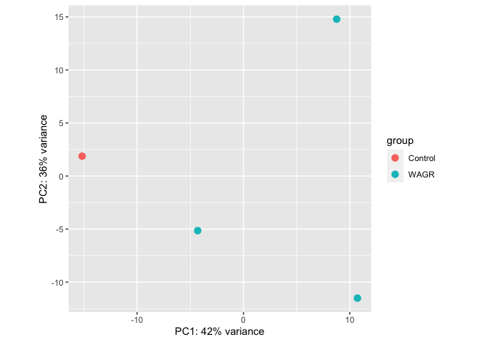
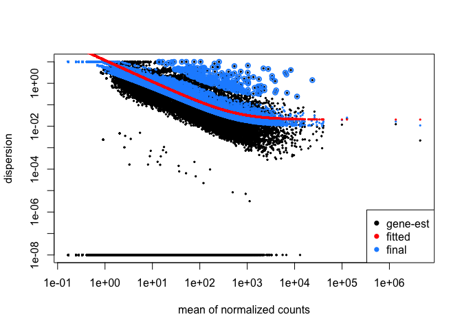
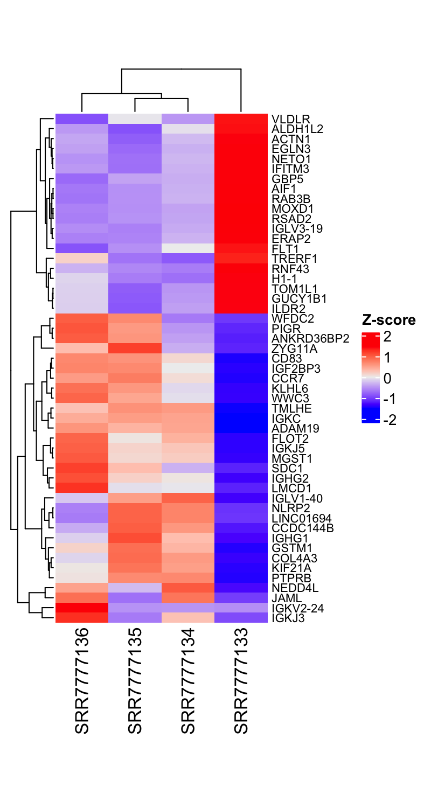
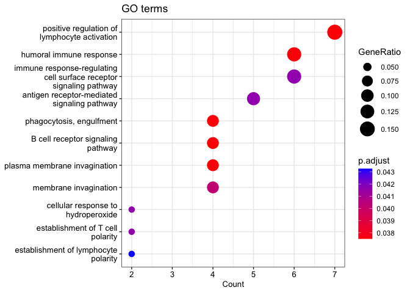
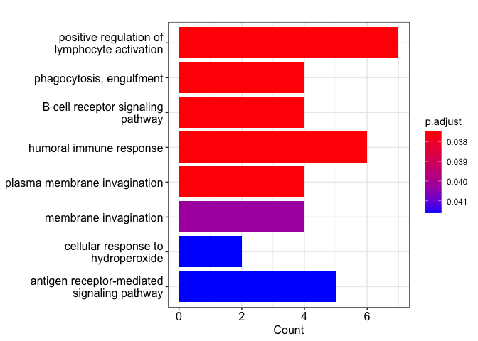
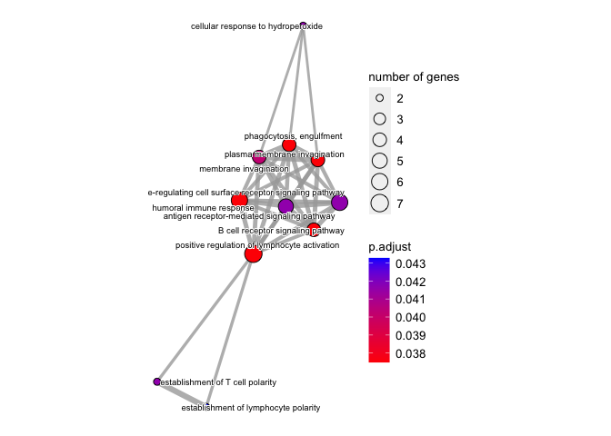

Bulk RNA analysis pipeline
================

This is a demonstration of a simple RNA-seq analysis pipeline. The raw
data is retrieved from GEO of NCBI. The accession number is *GSE119360*.

In brief, SRA data was retrieved using `prefetch`.

SRA data is transformed into FASTQ files using `fastq-dump`.

`fastqc` and `multiqc` are used for quality control.

Since the samples are sequenced using *Illumina Genome analyszer II*,
short (50bp) pair-end RNA sequences are generated. Judging by the QC
reports, no trimming is done.

These sequences are then mapped to *GRCh38.p10_v26* using `STAR`, by
first building an index with the desired reference and then mapping to
such index.

Mapped fragments are counted using `featureCounts` from `subread`
toolkit.

The results are then imported to `R` and analyzed using `DESeq2`.

The code of the first portion of data processing is not shown in this
document.

The second portion of data analysis starts with importing data from
featureCounts, as shown below.

Please refer to the [GEO
website](https://www.ncbi.nlm.nih.gov/geo/query/acc.cgi?acc=GSE119360)
for more sample preparation details.

Please refer to this bash script for the code of data preprocessing.

## Libraries

``` r
library(tidyverse)
library(clusterProfiler)
library(enrichplot)
library(DOSE)
library(ggnewscale)
library(pathview)
library(GEOquery)
library(ggplot2)
library(tximport)
library(DESeq2)
library(org.Hs.eg.db)
library(ComplexHeatmap)
library(RColorBrewer)
library(circlize)
library(dplyr)
```

## Getting metadata

``` r
gse <- getGEO(GEO = "GSE119360", GSEMatrix = T)
```

    ## Found 1 file(s)

    ## GSE119360_series_matrix.txt.gz

``` r
meta <- pData(phenoData(gse[[1]]))
```

Subsetting metadata

``` r
meta.subset = meta %>% 
  mutate(group = gsub("\\d_", "", title)) %>% 
  dplyr::select(group)

meta.subset$group = as.factor(meta.subset$group)
levels(meta.subset$group)
```

    ## [1] "Control" "WAGR"

``` r
meta.subset
```

    ##              group
    ## GSM3371765 Control
    ## GSM3371766    WAGR
    ## GSM3371767    WAGR
    ## GSM3371768    WAGR

## Importing data from *featureCounts*

``` r
count.data = read.table("counts_extracted.out",header = T,sep = "\t", row.names = 1)
names = paste0("SRR",seq(7777133,7777136))
colnames(count.data) = names
rownames(meta.subset) = names
head(count.data)
```

    ##                   SRR7777133 SRR7777134 SRR7777135 SRR7777136
    ## ENSG00000223972.5          0          0          0          0
    ## ENSG00000227232.5          4          4          1          1
    ## ENSG00000278267.1          0          0          2          1
    ## ENSG00000243485.5          0          0          0          0
    ## ENSG00000284332.1          0          0          0          0
    ## ENSG00000237613.2          0          0          0          0

## DESeq

``` r
dds = DESeqDataSetFromMatrix(countData = count.data, colData = meta.subset, design = ~group)
dds = DESeq(dds)
```

    ## estimating size factors

    ## estimating dispersions

    ## gene-wise dispersion estimates

    ## mean-dispersion relationship

    ## final dispersion estimates

    ## fitting model and testing

PCA plot to show that there is separation between two groups of sample.
As shown, PC1 accounts for 42% of the difference between the two groups.

``` r
vst=varianceStabilizingTransformation(dds, blind = F)
plotPCA(vst, intgroup = "group")
```

<!-- -->

Dispersion plot for QC. The red fitted line is decreasing as counts
increases. This is what we want to see.

``` r
plotDispEsts(dds)
```

<!-- -->

Extracting results and filtering out insignificant p-values.

The summary table shows us how many genes are up or down regulated.

``` r
res = results(dds, contrast = c("group", "WAGR", "Control"))
res = na.omit(res)
sigs = res[res$padj < 0.05,] ## only keeping padj < 0.05

## adding symbols per ensembl gene id
ensembl_id = rownames(sigs)
ensembl_id = gsub("\\.\\d{1,}","", ensembl_id)
sigs$symbol = mapIds(org.Hs.eg.db, 
       keys = ensembl_id, 
       keytype = "ENSEMBL", 
       column =  "SYMBOL")
```

    ## 'select()' returned 1:1 mapping between keys and columns

``` r
sigs = na.omit(sigs)
summary(sigs)
```

    ## 
    ## out of 115 with nonzero total read count
    ## adjusted p-value < 0.1
    ## LFC > 0 (up)       : 73, 63%
    ## LFC < 0 (down)     : 42, 37%
    ## outliers [1]       : 0, 0%
    ## low counts [2]     : 0, 0%
    ## (mean count < 21)
    ## [1] see 'cooksCutoff' argument of ?results
    ## [2] see 'independentFiltering' argument of ?results

``` r
df.hm = sigs[(sigs$baseMean > 50) & (abs(sigs$log2FoldChange) > 2),] ## Further filtering noise out
df.hm = df.hm[order(df.hm$log2FoldChange, decreasing = T),]
df.hm = as.data.frame(df.hm)
head(df.hm)
```

    ##                      baseMean log2FoldChange     lfcSE      stat        pvalue
    ## ENSG00000241294.1   254.64444      22.464333 5.6491654  3.976576  6.991479e-05
    ## ENSG00000211595.2    89.91385       9.198290 2.3937204  3.842675  1.217006e-04
    ## ENSG00000211653.2   342.75285       8.679738 1.6233351  5.346855  8.949545e-08
    ## ENSG00000211896.7  3866.21186       8.477069 1.9137235  4.429621  9.439888e-06
    ## ENSG00000211893.3   278.67758       8.385999 1.6187003  5.180699  2.210556e-07
    ## ENSG00000211592.8 22883.30711       7.581774 0.2532418 29.938874 6.141852e-197
    ##                            padj   symbol
    ## ENSG00000241294.1  1.134832e-02 IGKV2-24
    ## ENSG00000211595.2  1.814612e-02    IGKJ3
    ## ENSG00000211653.2  4.590401e-05 IGLV1-40
    ## ENSG00000211896.7  2.241624e-03    IGHG1
    ## ENSG00000211893.3  9.433031e-05    IGHG2
    ## ENSG00000211592.8 7.875696e-193     IGKC

## Calculating z-score table for heatmap

``` r
rlog_out = rlog(dds, blind=F) ## transform count into log2 scale
mat = assay(rlog_out)[rownames(df.hm),] ## subsetting those which pass the filter from above
base_mean = rowMeans(mat) 
mat.scaled = t(apply(mat, 1, scale)) ## z-score
colnames(mat.scaled) = colnames(mat)
head(mat.scaled)
```

    ##                   SRR7777133  SRR7777134 SRR7777135 SRR7777136
    ## ENSG00000241294.1 -0.5159537 -0.48508582 -0.4988409  1.4998804
    ## ENSG00000211595.2 -0.9316042  0.28343629 -0.6355297  1.2836976
    ## ENSG00000211653.2 -1.3188894  0.96614834  0.5402901 -0.1875490
    ## ENSG00000211896.7 -1.2822432  0.31210190  1.1127082 -0.1425668
    ## ENSG00000211893.3 -1.3271053  0.04800409  0.1821464  1.0969548
    ## ENSG00000211592.8 -1.4984803  0.50212814  0.5532454  0.4431068

``` r
##keeping only a certain number of most significant rows
keep = 25
rows_keep = c(seq(1,keep), seq((nrow(mat.scaled)-keep), nrow(mat.scaled)))
rows_keep
```

    ##  [1]  1  2  3  4  5  6  7  8  9 10 11 12 13 14 15 16 17 18 19 20 21 22 23 24 25
    ## [26] 44 45 46 47 48 49 50 51 52 53 54 55 56 57 58 59 60 61 62 63 64 65 66 67 68
    ## [51] 69

``` r
h= Heatmap(mat.scaled[rows_keep,], 
              cluster_rows = T, 
             cluster_columns = T,
             column_labels = colnames(mat.scaled),
             row_labels = df.hm[rows_keep,]$symbol,
             row_names_gp = gpar(fontsize = 8),
             name = "Z-score",
             height = unit(12,"cm"),
             width = unit(5, "cm")) 

png("heatmap.png", res = 200, width = 800, height = 1500)
print(h)
dev.off()
```

    ## quartz_off_screen 
    ##                 2

 As shown in the heatmap, the differential gene
expression is easily seen between the two groups. SRR7777133 is the
Control, while the rest of the samples are WAGR mutants.

## Functional analysis

To understand what the possible functions of these genes are, we can
look at gene ontology.

``` r
## getting Ensembl IDs
GO_ensembl_id = rownames(df.hm[rows_keep,])
GO_ensembl_id = gsub("\\.\\d{1,}", "", GO_ensembl_id)

ego = enrichGO(gene = GO_ensembl_id, 
         OrgDb = "org.Hs.eg.db",
         keyType = "ENSEMBL", 
         ont = "BP",
         readable = T)

dotplot(ego, 
        showCategory = 20, 
        x = "count",
        font.size = 10,
        title = "GO terms")
```

<!-- -->

``` r
barplot(ego)
```

<!-- -->

``` r
## Add similarity matrix to the termsim slot of enrichment result
ego <- enrichplot::pairwise_termsim(ego)

emapplot(ego, showCategory = 20, 
         cex_label_category = 0.5,
         cex_category = 0.8)
```

<!-- -->

System info for replicability.

``` r
sessionInfo()
```

    ## R version 4.2.1 (2022-06-23)
    ## Platform: x86_64-apple-darwin17.0 (64-bit)
    ## Running under: macOS Catalina 10.15.7
    ## 
    ## Matrix products: default
    ## BLAS:   /Library/Frameworks/R.framework/Versions/4.2/Resources/lib/libRblas.0.dylib
    ## LAPACK: /Library/Frameworks/R.framework/Versions/4.2/Resources/lib/libRlapack.dylib
    ## 
    ## locale:
    ## [1] en_US.UTF-8/en_US.UTF-8/en_US.UTF-8/C/en_US.UTF-8/en_US.UTF-8
    ## 
    ## attached base packages:
    ## [1] grid      stats4    stats     graphics  grDevices utils     datasets 
    ## [8] methods   base     
    ## 
    ## other attached packages:
    ##  [1] circlize_0.4.15             RColorBrewer_1.1-3         
    ##  [3] ComplexHeatmap_2.12.0       org.Hs.eg.db_3.15.0        
    ##  [5] AnnotationDbi_1.58.0        DESeq2_1.36.0              
    ##  [7] SummarizedExperiment_1.26.1 MatrixGenerics_1.8.1       
    ##  [9] matrixStats_0.62.0          GenomicRanges_1.48.0       
    ## [11] GenomeInfoDb_1.32.2         IRanges_2.30.0             
    ## [13] S4Vectors_0.34.0            tximport_1.24.0            
    ## [15] GEOquery_2.64.2             Biobase_2.56.0             
    ## [17] BiocGenerics_0.42.0         pathview_1.36.0            
    ## [19] ggnewscale_0.4.7            DOSE_3.22.0                
    ## [21] enrichplot_1.16.1           clusterProfiler_4.4.4      
    ## [23] forcats_0.5.1               stringr_1.4.0              
    ## [25] dplyr_1.0.9                 purrr_0.3.4                
    ## [27] readr_2.1.2                 tidyr_1.2.0                
    ## [29] tibble_3.1.8                ggplot2_3.3.6              
    ## [31] tidyverse_1.3.2            
    ## 
    ## loaded via a namespace (and not attached):
    ##   [1] utf8_1.2.2             R.utils_2.12.0         tidyselect_1.1.2      
    ##   [4] RSQLite_2.2.15         BiocParallel_1.30.3    scatterpie_0.1.7      
    ##   [7] munsell_0.5.0          codetools_0.2-18       withr_2.5.0           
    ##  [10] colorspace_2.0-3       GOSemSim_2.22.0        highr_0.9             
    ##  [13] knitr_1.39             rstudioapi_0.13        labeling_0.4.2        
    ##  [16] KEGGgraph_1.56.0       GenomeInfoDbData_1.2.8 polyclip_1.10-0       
    ##  [19] bit64_4.0.5            farver_2.1.1           downloader_0.4        
    ##  [22] vctrs_0.4.1            treeio_1.20.1          generics_0.1.3        
    ##  [25] xfun_0.31              R6_2.5.1               doParallel_1.0.17     
    ##  [28] clue_0.3-61            graphlayouts_0.8.0     locfit_1.5-9.6        
    ##  [31] bitops_1.0-7           cachem_1.0.6           fgsea_1.22.0          
    ##  [34] gridGraphics_0.5-1     DelayedArray_0.22.0    assertthat_0.2.1      
    ##  [37] scales_1.2.0           ggraph_2.0.5           googlesheets4_1.0.0   
    ##  [40] gtable_0.3.0           tidygraph_1.2.1        rlang_1.0.4           
    ##  [43] genefilter_1.78.0      GlobalOptions_0.1.2    splines_4.2.1         
    ##  [46] lazyeval_0.2.2         gargle_1.2.0           broom_1.0.0           
    ##  [49] yaml_2.3.5             reshape2_1.4.4         modelr_0.1.8          
    ##  [52] backports_1.4.1        qvalue_2.28.0          tools_4.2.1           
    ##  [55] ggplotify_0.1.0        ellipsis_0.3.2         Rcpp_1.0.9            
    ##  [58] plyr_1.8.7             zlibbioc_1.42.0        RCurl_1.98-1.7        
    ##  [61] GetoptLong_1.0.5       viridis_0.6.2          haven_2.5.0           
    ##  [64] ggrepel_0.9.1          cluster_2.1.3          fs_1.5.2              
    ##  [67] magrittr_2.0.3         magick_2.7.3           data.table_1.14.2     
    ##  [70] DO.db_2.9              reprex_2.0.1           googledrive_2.0.0     
    ##  [73] hms_1.1.1              patchwork_1.1.1        evaluate_0.15         
    ##  [76] xtable_1.8-4           XML_3.99-0.10          readxl_1.4.0          
    ##  [79] gridExtra_2.3          shape_1.4.6            compiler_4.2.1        
    ##  [82] crayon_1.5.1           shadowtext_0.1.2       R.oo_1.25.0           
    ##  [85] htmltools_0.5.3        ggfun_0.0.6            tzdb_0.3.0            
    ##  [88] geneplotter_1.74.0     aplot_0.1.6            lubridate_1.8.0       
    ##  [91] DBI_1.1.3              tweenr_1.0.2           dbplyr_2.2.1          
    ##  [94] MASS_7.3-58            Matrix_1.4-1           cli_3.3.0             
    ##  [97] R.methodsS3_1.8.2      parallel_4.2.1         igraph_1.3.4          
    ## [100] pkgconfig_2.0.3        xml2_1.3.3             foreach_1.5.2         
    ## [103] ggtree_3.4.1           annotate_1.74.0        XVector_0.36.0        
    ## [106] rvest_1.0.2            yulab.utils_0.0.5      digest_0.6.29         
    ## [109] graph_1.74.0           Biostrings_2.64.0      rmarkdown_2.14        
    ## [112] cellranger_1.1.0       fastmatch_1.1-3        tidytree_0.3.9        
    ## [115] curl_4.3.2             rjson_0.2.21           lifecycle_1.0.1       
    ## [118] nlme_3.1-158           jsonlite_1.8.0         viridisLite_0.4.0     
    ## [121] limma_3.52.2           fansi_1.0.3            pillar_1.8.0          
    ## [124] lattice_0.20-45        KEGGREST_1.36.3        fastmap_1.1.0         
    ## [127] httr_1.4.3             survival_3.3-1         GO.db_3.15.0          
    ## [130] glue_1.6.2             png_0.1-7              iterators_1.0.14      
    ## [133] bit_4.0.4              Rgraphviz_2.40.0       ggforce_0.3.3         
    ## [136] stringi_1.7.8          blob_1.2.3             memoise_2.0.1         
    ## [139] ape_5.6-2
