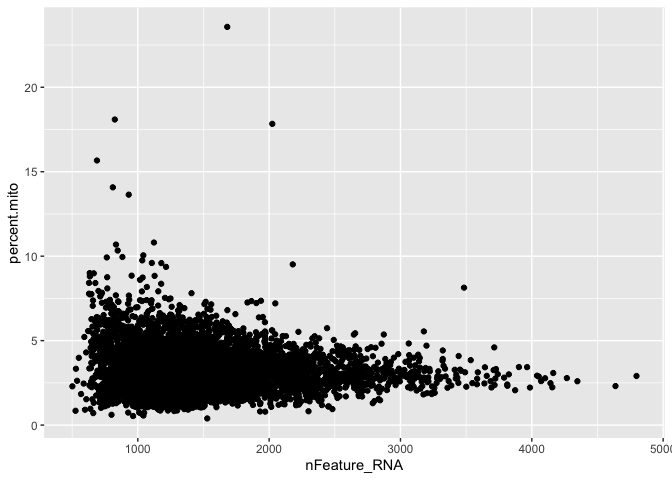
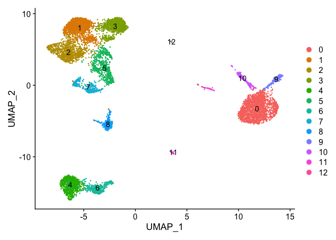
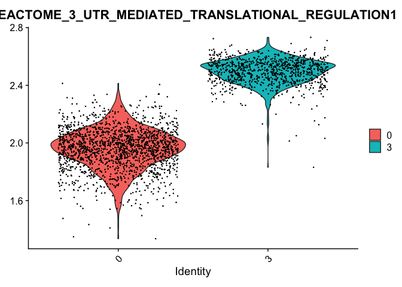

scRNA-seq analysis pipeline
================

This is a demonstration of scRNA-seq analysis using Seurat on R. scanpy
can be used for python users.

This dataset is downloaded from [10X
Genomics](https://www.10xgenomics.com/resources/datasets).

The processing steps of raw reads to counts can be done online/running
CellRanger Tool on HPC clusters.

# Libraries

``` r
library(tidyverse)
library(Seurat)
```

# Load data

``` r
pbmc_data = Read10X("../data/filtered_gene_bc_matrices_8kpbmc/GRCh38/")
```

# Seurat object

``` r
seurat = CreateSeuratObject(count = pbmc_data, 
                            min.cell = 3, 
                            project = "PBMC")
```

# QA and filtering

``` r
seurat[["percent.mito"]] = PercentageFeatureSet(seurat, pattern = "^MT-") ##calculating mito percentage
```

Lets make violin plots to see if the dataset is of high quality.

``` r
VlnPlot(seurat, 
        features = c("nFeature_RNA", "nCount_RNA", "percent.mito"), 
        pt.size = .2, 
        ncol = 3)
```

<!-- -->

As shown above, the number of RNA features and RNA count is really high,
which is ideal. The percentage of mitochondrial RNA is also really low
(\~5%), meaning the dataset is fairly “clean”. (Not many cells bursted)

It is hard to see with all these dots in the way. Let’s make a histogram
to inspect percent.mito to find a cutoff.

``` r
hist(seurat$percent.mito, breaks = 50)
```

<!-- -->

Just to see the relation between percent.mito and nFeature_RNA.

``` r
qplot(x=nFeature_RNA, y=percent.mito, data = seurat@meta.data)
```

<!-- -->

This is an arbitray threshold, but I am choosing 7.5% as a cutoff here.
(dump anything \> 7.5% mito)

## Subsetting

Keeping cells with more than 200 RNAs ***AND*** less than 7.5% mito RNA.

``` r
seurat = subset(seurat, 
                subset = percent.mito < 7.5 &
                nFeature_RNA > 200)
```

## Normalization (Library-size scaling)

``` r
seurat = NormalizeData(seurat)
```

# Dimensionality Reduction

``` r
seurat = FindVariableFeatures(seurat, 
                              selection.method = "vst",
                              nfeatures = 2000)
```

Looking at top 20 variable genes.

``` r
head(VariableFeatures(seurat), n = 20)
```

    ##  [1] "IGLC3"      "IGLC2"      "PPBP"       "FCER1A"     "PF4"       
    ##  [6] "PTGDS"      "GNLY"       "GZMB"       "LILRA4"     "JCHAIN"    
    ## [11] "S100A8"     "SDPR"       "IGKC"       "AL928768.3" "S100A9"    
    ## [16] "HLA-DQA1"   "TUBB1"      "HLA-DRA"    "CD74"       "HLA-DPA1"

## PCA: linear DR

``` r
seurat = ScaleData(seurat)
```

    ## Centering and scaling data matrix

``` r
seurat = RunPCA(seurat)
```

    ## PC_ 1 
    ## Positive:  LTB, TRAC, CD3D, IL32, TRBC2, CD69, CD3G, CD7, CD27, IL7R 
    ##     IFITM1, RPS2, CD2, LEF1, CCR7, TRBC1, SPOCK2, NOSIP, CD247, CTSW 
    ##     TRAT1, GZMM, MAL, CD8B, CD8A, ITM2A, SYNE2, PIM2, AQP3, CDC25B 
    ## Negative:  CST3, LYZ, CSTA, MNDA, LST1, TYROBP, FCN1, FTL, AIF1, CTSS 
    ##     TYMP, FCER1G, S100A9, RP11-1143G9.4, LGALS1, FTH1, S100A8, LGALS2, SERPINA1, SPI1 
    ##     FGL2, S100A11, GRN, PSAP, CFD, GPX1, AP1S2, MS4A6A, CLEC7A, CD68 
    ## PC_ 2 
    ## Positive:  IL32, CD3D, TMSB4X, CTSW, CD7, TRAC, GZMA, NKG7, S100A4, CST7 
    ##     IFITM1, CCL5, GZMM, CD247, ANXA1, PRF1, CD2, KLRD1, CD3G, PFN1 
    ##     SRGN, S100A6, ITGB2, KLRB1, ID2, HOPX, IL7R, LYAR, KLRG1, GNLY 
    ## Negative:  CD79A, MS4A1, IGHM, IGHD, CD79B, TCL1A, IGKC, LINC00926, BANK1, CD74 
    ##     CD22, HLA-DQB1, HLA-DRA, HLA-DPA1, VPREB3, TNFRSF13C, HLA-DPB1, FCER2, FAM129C, MEF2C 
    ##     RALGPS2, HLA-DRB1, HLA-DQA1, HLA-DOB, FCRLA, SPIB, EAF2, HLA-DMB, HVCN1, TSPAN13 
    ## PC_ 3 
    ## Positive:  LEF1, CCR7, RPS2, MAL, S100A12, JUNB, TRAC, LTB, S100A8, VCAN 
    ##     S100A9, NOSIP, RGCC, RP11-1143G9.4, CD14, LRRN3, IL7R, FCN1, NELL2, RBP7 
    ##     FHIT, FOS, CXCL8, CSTA, CD27, TMSB10, AIF1, SOCS3, MNDA, CD3D 
    ## Negative:  GZMB, NKG7, PRF1, KLRD1, CST7, CLIC3, GZMA, FGFBP2, KLRF1, GNLY 
    ##     HOPX, SPON2, C12orf75, CD160, RHOC, CCL4, CCL5, CTSW, GZMH, XCL2 
    ##     FCGR3A, MATK, CMC1, TRDC, S1PR5, PLEK, ADGRG1, IL2RB, APOBEC3G, TBX21 
    ## PC_ 4 
    ## Positive:  LILRA4, LRRC26, SERPINF1, CLEC4C, IL3RA, SCT, TPM2, DERL3, PPP1R14B, PTCRA 
    ##     PLD4, LINC00996, TNFRSF21, ITM2C, DNASE1L3, SMPD3, LAMP5, MAP1A, GAS6, UGCG 
    ##     PTPRS, RP11-73G16.2, MYBL2, JCHAIN, ASIP, SCAMP5, FCER1A, CCDC50, IRF7, APP 
    ## Negative:  KLRD1, NKG7, FGFBP2, PRF1, CST7, KLRF1, GZMA, CD79B, MS4A1, GNLY 
    ##     HOPX, CD79A, IGHD, CCL4, CD160, FCGR3A, LINC00926, SPON2, XCL2, FCER2 
    ##     S1PR5, TRDC, GZMH, CD22, TTC38, MT-CO1, MATK, ADGRG1, TNFRSF13C, VPREB3 
    ## PC_ 5 
    ## Positive:  RPS2, TMSB10, LILRA4, LRRC26, SERPINF1, IL3RA, PPP1R14B, PLD4, CLEC4C, CCDC50 
    ##     SCT, DERL3, LINC00996, DNASE1L3, TPM2, IRF7, UGCG, TNFRSF21, LILRB4, LAMP5 
    ##     SMPD3, MYBL2, ASIP, SCAMP5, JCHAIN, CORO1A, MT-CO1, GAS6, ITM2C, RP11-117D22.2 
    ## Negative:  SDPR, PPBP, GNG11, TUBB1, PF4, CLU, SPARC, HIST1H2AC, ACRBP, GP9 
    ##     CTTN, ITGA2B, CMTM5, TMEM40, C2orf88, TSC22D1, HRAT92, MMD, MAP3K7CL, NRGN 
    ##     CLDN5, TREML1, HGD, HIST1H2BJ, GMPR, CA2, CD9, MYLK, SH3BGRL2, ESAM

``` r
DimPlot(seurat)
```

<!-- -->

Just randomly picking 4 genes from PC_1 to show heterogeneity.

``` r
FeaturePlot(seurat, features = c("CD3D", "CST3", "TRAC", "CD68"), cols = c("lightgrey","red"))
```

<!-- -->

To see how many PCs are capturing the difference (probably 25? 30?)

``` r
ElbowPlot(seurat, ndims = 50)
```

<!-- -->

## UMAP: non-linear DR

Not using t-SNE because it is basically inferior.

[UMAP displays global structures while t-SNE does
not.](https://blog.bioturing.com/2022/01/14/umap-vs-t-sne-single-cell-rna-seq-data-visualization/#:~:text=t%2DSNE%20and%20UMAP%20have,UMAP%20compresses%20that%20graph.)

``` r
seurat = RunUMAP(seurat, dims = 1:30)
```

    ## Warning: The default method for RunUMAP has changed from calling Python UMAP via reticulate to the R-native UWOT using the cosine metric
    ## To use Python UMAP via reticulate, set umap.method to 'umap-learn' and metric to 'correlation'
    ## This message will be shown once per session

    ## 16:41:42 UMAP embedding parameters a = 0.9922 b = 1.112

    ## 16:41:42 Read 8337 rows and found 30 numeric columns

    ## 16:41:42 Using Annoy for neighbor search, n_neighbors = 30

    ## 16:41:42 Building Annoy index with metric = cosine, n_trees = 50

    ## 0%   10   20   30   40   50   60   70   80   90   100%

    ## [----|----|----|----|----|----|----|----|----|----|

    ## **************************************************|
    ## 16:41:43 Writing NN index file to temp file /var/folders/7f/c8hmgrnx0_z110d0h8mhdprm0000gr/T//Rtmpz0Y0UX/fileb382bb96d61
    ## 16:41:43 Searching Annoy index using 1 thread, search_k = 3000
    ## 16:41:45 Annoy recall = 100%
    ## 16:41:45 Commencing smooth kNN distance calibration using 1 thread with target n_neighbors = 30
    ## 16:41:46 Initializing from normalized Laplacian + noise (using irlba)
    ## 16:41:46 Commencing optimization for 500 epochs, with 360534 positive edges
    ## 16:41:58 Optimization finished

``` r
DimPlot(seurat)
```

<!-- -->

``` r
FeaturePlot(seurat, features = c("CD3D", "CST3", "TRAC", "CD68"), cols = c("lightgrey","red"))
```

<!-- -->

# Clustering

``` r
seurat = FindNeighbors(seurat, dims = 1:30)
```

    ## Computing nearest neighbor graph

    ## Computing SNN

``` r
seurat = FindClusters(seurat, resolution = 0.2)
```

    ## Modularity Optimizer version 1.3.0 by Ludo Waltman and Nees Jan van Eck
    ## 
    ## Number of nodes: 8337
    ## Number of edges: 347595
    ## 
    ## Running Louvain algorithm...
    ## Maximum modularity in 10 random starts: 0.9555
    ## Number of communities: 13
    ## Elapsed time: 0 seconds

``` r
DimPlot(seurat, label = T)
```

<!-- -->

``` r
cluster_markers = FindAllMarkers(seurat, 
                                 logfc.threshold = 0.5, 
                                 only.pos = T)
```

    ## Calculating cluster 0

    ## Calculating cluster 1

    ## Calculating cluster 2

    ## Calculating cluster 3

    ## Calculating cluster 4

    ## Calculating cluster 5

    ## Calculating cluster 6

    ## Calculating cluster 7

    ## Calculating cluster 8

    ## Calculating cluster 9

    ## Calculating cluster 10

    ## Calculating cluster 11

    ## Calculating cluster 12

``` r
top_genes = cluster_markers %>% 
  group_by(cluster) %>% 
  top_n(1, avg_log2FC) %>% 
  pull(gene)
```

``` r
FeaturePlot(seurat, features = top_genes[1:9], 
            cols = c('lightgrey', 'red'), 
            pt.size = 0.1)
```

<!-- -->

# Other visualization tools

``` r
VlnPlot(seurat, features = "CCL5", pt.size = 0.3)
```

<!-- -->

``` r
RidgePlot(seurat, features =  "CCL5")
```

    ## Picking joint bandwidth of 0.148

<!-- -->

# Differential Expression

``` r
FeaturePlot(seurat, features = "CD4")
```

<!-- -->

From this, just pretend:

Cluster 0 = Memory CD4 T cells

Cluster 3 = Naive CD4 cells

``` r
dge_tcells = FindMarkers(seurat, 
                         ident.1 = 0, 
                         ident.2 = 3, 
                         only.pos = F, 
                         logfc.threshold = 0)
```

## GSEA

``` r
library(fgsea)
```

### Loading gmt data

These data can be found
[here](http://www.gsea-msigdb.org/gsea/msigdb/collections.jsp)

``` r
hallmarks = gmtPathways("../data/hallmark.genesets.v6.1.symbols.gmt")
kegg = gmtPathways("../data/kegg.genesets.v6.1.symbols.gmt")
reactome = gmtPathways("../data/reactome.genesets.v6.1.symbols.gmt")
go = gmtPathways("../data/GOTerms.BP.v6.1.symbols.gmt")

gene_sets = c(hallmarks, kegg, reactome, go)
```

Pairing gene names with fold change.

``` r
dge_tcells$gene = rownames(dge_tcells)
dge_tcells = dge_tcells %>% 
  arrange(desc(avg_log2FC))
fold_changes = dge_tcells$avg_log2FC
names(fold_changes) = dge_tcells$gene
```

``` r
gsea_tcell = fgsea(pathways = gene_sets, 
                   stats = fold_changes, 
                   minSize = 5, 
                   maxSize = 5000, 
                   nproc = 2)
```

    ## Warning in fgseaMultilevel(...): There were 14 pathways for which P-values were
    ## not calculated properly due to unbalanced (positive and negative) gene-level
    ## statistic values. For such pathways pval, padj, NES, log2err are set to NA. You
    ## can try to increase the value of the argument nPermSimple (for example set it
    ## nPermSimple = 10000)

    ## Warning in fgseaMultilevel(...): For some of the pathways the P-values were
    ## likely overestimated. For such pathways log2err is set to NA.

``` r
gsea_sig = filter(gsea_tcell, padj <= 0.05) %>% 
  arrange(NES)
```

### Gene Set Scoring

Seurat has a function to score each cell for a set of pre-defined genes.

``` r
head(gsea_sig)
```

    ##                                                                   pathway
    ## 1:                                      REACTOME_PEPTIDE_CHAIN_ELONGATION
    ## 2: REACTOME_NONSENSE_MEDIATED_DECAY_ENHANCED_BY_THE_EXON_JUNCTION_COMPLEX
    ## 3:                       REACTOME_3_UTR_MEDIATED_TRANSLATIONAL_REGULATION
    ## 4:                                                          KEGG_RIBOSOME
    ## 5:  GO_NUCLEAR_TRANSCRIBED_MRNA_CATABOLIC_PROCESS_NONSENSE_MEDIATED_DECAY
    ## 6:             REACTOME_INFLUENZA_VIRAL_RNA_TRANSCRIPTION_AND_REPLICATION
    ##            pval         padj  log2err         ES       NES size
    ## 1: 3.197265e-41 4.247034e-38 1.671997 -0.8856855 -3.548200   83
    ## 2: 3.467566e-40 3.454562e-37 1.653315 -0.8521483 -3.527673   96
    ## 3: 4.810033e-43 1.916798e-39 1.708748 -0.8527639 -3.515888  102
    ## 4: 7.529579e-38 5.000895e-35 1.602431 -0.8661764 -3.510997   85
    ## 5: 2.594270e-41 4.247034e-38 1.671997 -0.8453954 -3.485508  102
    ## 6: 5.010968e-38 3.993742e-35 1.602431 -0.8361947 -3.433832   98
    ##                              leadingEdge
    ## 1: RPSA,RPS29,RPL31,RPL3,RPL23A,RPS5,...
    ## 2: RPSA,RPS29,RPL31,RPL3,RPL23A,RPS5,...
    ## 3: RPSA,RPS29,RPL31,RPL3,RPL23A,RPS5,...
    ## 4: RPSA,RPS29,RPL31,RPL3,RPL23A,RPS5,...
    ## 5: RPSA,RPS29,RPL31,RPL3,RPL23A,RPS5,...
    ## 6: RPSA,RPS29,RPL31,RPL3,RPL23A,RPS5,...

Using “REACTOME_3\_UTR_MEDIATED_TRANSLATIONAL_REGULATION”

``` r
seurat = AddModuleScore(seurat, 
                        features = gene_sets["REACTOME_3_UTR_MEDIATED_TRANSLATIONAL_REGULATION"], 
                        name = "REACTOME_3_UTR_MEDIATED_TRANSLATIONAL_REGULATION")
```

    ## Warning: The following features are not present in the object: RPL7AP27,
    ## RPL10P16, EIF3FP3, RPL36P14, RPSAP12, RPS8P10, RPL7AP66, RPL10P9, RPS12P4,
    ## RPS26P10, RPL23AP2, RPS12P22, RPL21P29, RPS26P35, RPL3L, RPL6P19, LOC641895,
    ## RPL36AP31, RPS29P3, RPS26P28, RPL36AP8, RPL26P22, RPS26P20, RPS15AP11,
    ## RPS26P50, RPL22P11, RPL17P6, RPS13P8, RPS28P4, RPL32P16, LOC646184, RPS28P7,
    ## RPL12P2, LOC647074, RPL23AP42, RPL5P1, RPL36AP51, LOC649602, RPS28P9, RPL34P27,
    ## LOC651825, LOC651894, LOC652607, RPL26P30, RPSAP9, RPL19P9, RPL21P119, RPL31P17,
    ## LOC653881, LOC653994, RPL31P31, RPL15P17, RPL23AP18, RPL26P24, RPL21P75,
    ## RPS27AP11, RPS26P7, RPL21P134, RPS26P25, RPS19P3, RPL36AP23, RPS18P10, RPL17P36,
    ## RPL36AP37, RPL21P16, RPL23AP74, RPS15P5, RPL23AP63, RPS10P9, LOC730343, RPS18P5,
    ## RPL34P31, not searching for symbol synonyms

``` r
FeaturePlot(seurat, 
            features = 'REACTOME_3_UTR_MEDIATED_TRANSLATIONAL_REGULATION1', 
            cols = c('lightgrey', 'red'), 
            order = T)
```

<!-- -->

Cannot really see the difference, perhaps quantitative plots will show
the difference better.

``` r
VlnPlot(seurat, 
        features = 'REACTOME_3_UTR_MEDIATED_TRANSLATIONAL_REGULATION1',
        pt.size = 0.1)
```

<!-- -->

Just to visualize between clusters 0 and 3.

``` r
VlnPlot(seurat, 
        features = 'REACTOME_3_UTR_MEDIATED_TRANSLATIONAL_REGULATION1',
        pt.size = 0.1,
        idents = c(0,3))
```

<!-- -->

## Generic pathway activity

``` r
library(progeny)
library(dorothea)
```

PROGENy is resource that leverages a large compendium of publicly
available signaling perturbation experiments to yield a common core of
pathway responsive genes for human and mouse. These, coupled with any
statistical method, can be used to infer pathway activities from bulk or
single-cell transcriptomics.

``` r
exp_mat <- as.matrix(seurat[["RNA"]]@data)
pathways <- progeny(exp_mat, 
                    scale=T,
                    organism="Human")
head(pathways)
```

    ##                      Androgen       EGFR    Estrogen    Hypoxia    JAK-STAT
    ## AAACCTGAGCATCATC-1  0.3739243 -0.4210440 -0.78385318 -1.1249665  0.67011656
    ## AAACCTGAGCTAACTC-1  2.7119002  0.2909708 -0.03740632 -1.8433863 -1.71976461
    ## AAACCTGAGCTAGTGG-1 -0.5505979  0.8010731 -1.29041327 -0.1874210 -0.39791280
    ## AAACCTGCACATTAGC-1 -0.3145123 -0.7765205  0.47579680 -0.6871366 -0.57441065
    ## AAACCTGCACTGTTAG-1 -0.7444938 -0.6553544 -0.71494058  0.3190308  0.09406944
    ## AAACCTGCATAGTAAG-1 -1.0022811  1.9276188  1.03985549  0.8439905 -0.67957704
    ##                           MAPK        NFkB         p53       PI3K       TGFb
    ## AAACCTGAGCATCATC-1 -1.20917331 -0.57688702  0.07485003 -1.0042793 -0.3322471
    ## AAACCTGAGCTAACTC-1 -0.08691169  2.53382293  1.95327039  0.9286018 -0.8537470
    ## AAACCTGAGCTAGTGG-1  0.37064068  0.60223197 -0.69110332 -0.4516438 -0.8537470
    ## AAACCTGCACATTAGC-1 -0.06118787 -0.57720013  0.09310605  0.6141208 -0.8537470
    ## AAACCTGCACTGTTAG-1  0.11030241 -0.05813758  1.20997367  0.8426313  0.4057307
    ## AAACCTGCATAGTAAG-1  1.57816952  2.73578623  0.60775587  1.3185506  2.1414269
    ##                          TNFa       Trail       VEGF         WNT
    ## AAACCTGAGCATCATC-1 -0.5247113  0.33435896 -2.2811348 -0.89091415
    ## AAACCTGAGCTAACTC-1  1.9345054  0.45856154  0.4521791  0.09653278
    ## AAACCTGAGCTAGTGG-1  0.9729998 -1.53629839  0.4521791 -0.57886926
    ## AAACCTGCACATTAGC-1 -1.1875851  0.98301596  0.4521791 -0.49894987
    ## AAACCTGCACTGTTAG-1 -0.1982560  0.24193442 -1.7321771  0.29473206
    ## AAACCTGCATAGTAAG-1  2.7259701 -0.02727536  0.5453691  0.18776337

We can add all of this data into our metadata

``` r
seurat@meta.data <- cbind(seurat@meta.data, pathways)
```

And visualize activities. I’ll just get a list of the different pathways
from the column names of that “pathways” variable

``` r
RidgePlot(seurat, features = colnames(pathways), ncol = 4)
```

    ## Picking joint bandwidth of 0.233

    ## Picking joint bandwidth of 0.218

    ## Picking joint bandwidth of 0.255

    ## Picking joint bandwidth of 0.226

    ## Picking joint bandwidth of 0.193

    ## Picking joint bandwidth of 0.232

    ## Picking joint bandwidth of 0.177

    ## Picking joint bandwidth of 0.231

    ## Picking joint bandwidth of 0.248

    ## Picking joint bandwidth of 0.266

    ## Picking joint bandwidth of 0.177

    ## Picking joint bandwidth of 0.232

    ## Picking joint bandwidth of 0.233

    ## Picking joint bandwidth of 0.255

<!-- -->

``` r
sessionInfo()
```

    ## R version 4.2.1 (2022-06-23)
    ## Platform: x86_64-apple-darwin17.0 (64-bit)
    ## Running under: macOS Catalina 10.15.7
    ## 
    ## Matrix products: default
    ## BLAS:   /Library/Frameworks/R.framework/Versions/4.2/Resources/lib/libRblas.0.dylib
    ## LAPACK: /Library/Frameworks/R.framework/Versions/4.2/Resources/lib/libRlapack.dylib
    ## 
    ## locale:
    ## [1] en_US.UTF-8/en_US.UTF-8/en_US.UTF-8/C/en_US.UTF-8/en_US.UTF-8
    ## 
    ## attached base packages:
    ## [1] stats     graphics  grDevices utils     datasets  methods   base     
    ## 
    ## other attached packages:
    ##  [1] dorothea_1.8.0     progeny_1.18.0     fgsea_1.22.0       sp_1.5-0          
    ##  [5] SeuratObject_4.1.0 Seurat_4.1.1       forcats_0.5.2      stringr_1.4.1     
    ##  [9] dplyr_1.0.9        purrr_0.3.4        readr_2.1.2        tidyr_1.2.0       
    ## [13] tibble_3.1.8       ggplot2_3.3.6      tidyverse_1.3.2   
    ## 
    ## loaded via a namespace (and not attached):
    ##   [1] readxl_1.4.1          backports_1.4.1       fastmatch_1.1-3      
    ##   [4] plyr_1.8.7            igraph_1.3.4          lazyeval_0.2.2       
    ##   [7] splines_4.2.1         BiocParallel_1.30.3   listenv_0.8.0        
    ##  [10] scattermore_0.8       digest_0.6.29         htmltools_0.5.3      
    ##  [13] fansi_1.0.3           magrittr_2.0.3        tensor_1.5           
    ##  [16] googlesheets4_1.0.1   cluster_2.1.4         ROCR_1.0-11          
    ##  [19] limma_3.52.2          tzdb_0.3.0            globals_0.16.1       
    ##  [22] modelr_0.1.9          matrixStats_0.62.0    spatstat.sparse_2.1-1
    ##  [25] colorspace_2.0-3      rvest_1.0.3           ggrepel_0.9.1        
    ##  [28] haven_2.5.1           xfun_0.32             crayon_1.5.1         
    ##  [31] jsonlite_1.8.0        progressr_0.10.1      spatstat.data_2.2-0  
    ##  [34] survival_3.4-0        zoo_1.8-10            glue_1.6.2           
    ##  [37] polyclip_1.10-0       gtable_0.3.0          gargle_1.2.0         
    ##  [40] leiden_0.4.2          future.apply_1.9.0    abind_1.4-5          
    ##  [43] scales_1.2.1          DBI_1.1.3             spatstat.random_2.2-0
    ##  [46] miniUI_0.1.1.1        Rcpp_1.0.9            viridisLite_0.4.1    
    ##  [49] xtable_1.8-4          reticulate_1.25       spatstat.core_2.4-4  
    ##  [52] htmlwidgets_1.5.4     httr_1.4.4            RColorBrewer_1.1-3   
    ##  [55] ellipsis_0.3.2        ica_1.0-3             pkgconfig_2.0.3      
    ##  [58] farver_2.1.1          uwot_0.1.14           dbplyr_2.2.1         
    ##  [61] deldir_1.0-6          utf8_1.2.2            tidyselect_1.1.2     
    ##  [64] labeling_0.4.2        rlang_1.0.4           reshape2_1.4.4       
    ##  [67] later_1.3.0           munsell_0.5.0         cellranger_1.1.0     
    ##  [70] tools_4.2.1           cli_3.3.0             generics_0.1.3       
    ##  [73] broom_1.0.0           ggridges_0.5.3        evaluate_0.16        
    ##  [76] fastmap_1.1.0         yaml_2.3.5            goftest_1.2-3        
    ##  [79] knitr_1.40            fs_1.5.2              fitdistrplus_1.1-8   
    ##  [82] bcellViper_1.32.0     RANN_2.6.1            pbapply_1.5-0        
    ##  [85] future_1.27.0         nlme_3.1-159          mime_0.12            
    ##  [88] xml2_1.3.3            compiler_4.2.1        rstudioapi_0.14      
    ##  [91] plotly_4.10.0         png_0.1-7             spatstat.utils_2.3-1 
    ##  [94] reprex_2.0.2          stringi_1.7.8         highr_0.9            
    ##  [97] rgeos_0.5-9           lattice_0.20-45       Matrix_1.4-1         
    ## [100] vctrs_0.4.1           pillar_1.8.1          lifecycle_1.0.1      
    ## [103] spatstat.geom_2.4-0   lmtest_0.9-40         RcppAnnoy_0.0.19     
    ## [106] data.table_1.14.2     cowplot_1.1.1         irlba_2.3.5          
    ## [109] httpuv_1.6.5          patchwork_1.1.2       R6_2.5.1             
    ## [112] promises_1.2.0.1      KernSmooth_2.23-20    gridExtra_2.3        
    ## [115] parallelly_1.32.1     codetools_0.2-18      MASS_7.3-58.1        
    ## [118] assertthat_0.2.1      withr_2.5.0           sctransform_0.3.4    
    ## [121] mgcv_1.8-40           parallel_4.2.1        hms_1.1.2            
    ## [124] grid_4.2.1            rpart_4.1.16          rmarkdown_2.16       
    ## [127] googledrive_2.0.0     Rtsne_0.16            shiny_1.7.2          
    ## [130] lubridate_1.8.0
